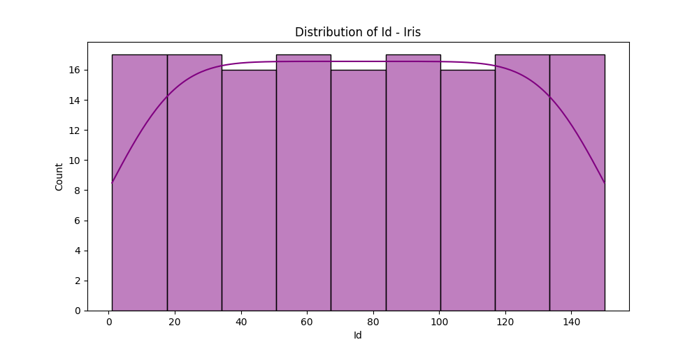
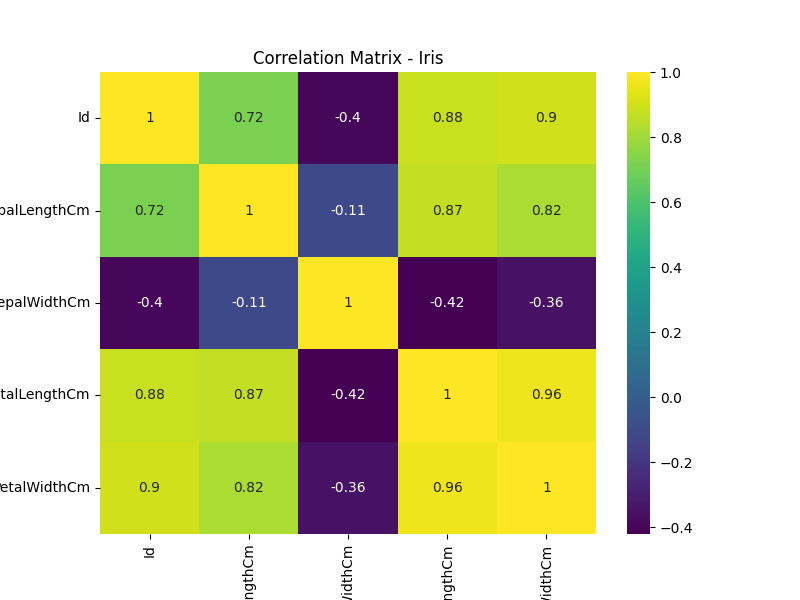
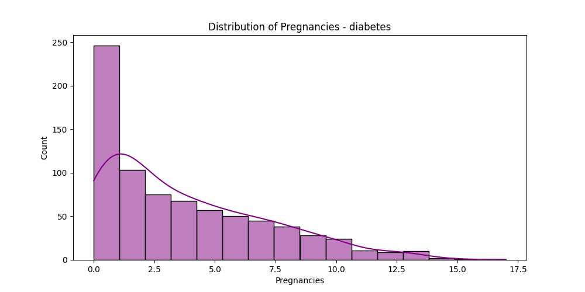
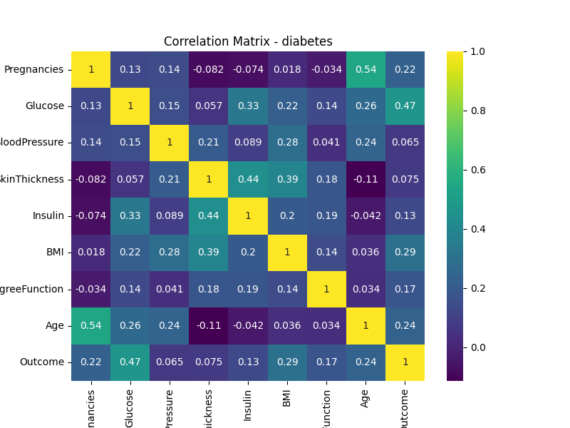
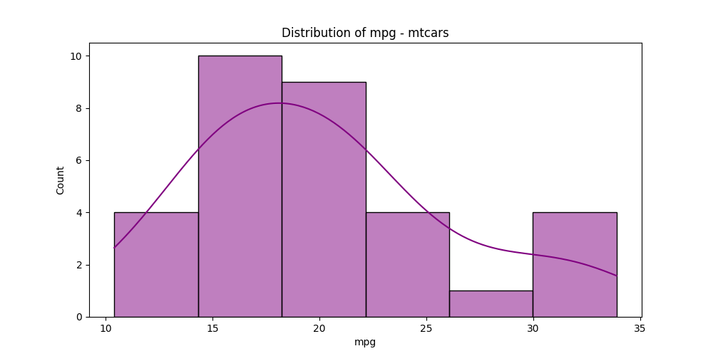
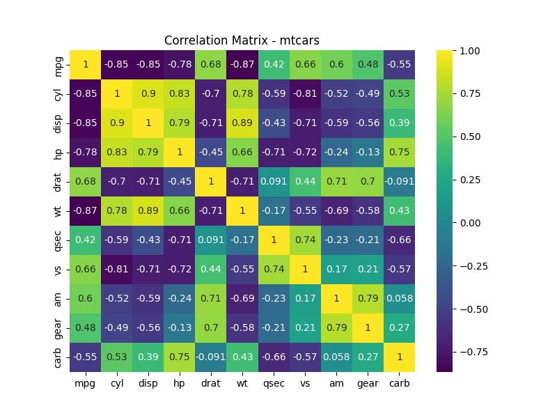

# 📊 Week 3: Advanced Analysis Results

## Iris.csv Analysis

### Data Preview
|    |   Id |   SepalLengthCm |   SepalWidthCm |   PetalLengthCm |   PetalWidthCm | Species     |
|---:|-----:|----------------:|---------------:|----------------:|---------------:|:------------|
|  0 |    1 |             5.1 |            3.5 |             1.4 |            0.2 | Iris-setosa |
|  1 |    2 |             4.9 |            3   |             1.4 |            0.2 | Iris-setosa |
|  2 |    3 |             4.7 |            3.2 |             1.3 |            0.2 | Iris-setosa |
|  3 |    4 |             4.6 |            3.1 |             1.5 |            0.2 | Iris-setosa |
|  4 |    5 |             5   |            3.6 |             1.4 |            0.2 | Iris-setosa |

### Visualizations
- 
- 

## diabetes.csv Analysis

### Data Preview
|    |   Pregnancies |   Glucose |   BloodPressure |   SkinThickness |   Insulin |   BMI |   DiabetesPedigreeFunction |   Age |   Outcome |
|---:|--------------:|----------:|----------------:|----------------:|----------:|------:|---------------------------:|------:|----------:|
|  0 |             6 |       148 |              72 |              35 |         0 |  33.6 |                      0.627 |    50 |         1 |
|  1 |             1 |        85 |              66 |              29 |         0 |  26.6 |                      0.351 |    31 |         0 |
|  2 |             8 |       183 |              64 |               0 |         0 |  23.3 |                      0.672 |    32 |         1 |
|  3 |             1 |        89 |              66 |              23 |        94 |  28.1 |                      0.167 |    21 |         0 |
|  4 |             0 |       137 |              40 |              35 |       168 |  43.1 |                      2.288 |    33 |         1 |

### Visualizations
- 
- 

## mtcars.csv Analysis

### Data Preview
|    | model             |   mpg |   cyl |   disp |   hp |   drat |    wt |   qsec |   vs |   am |   gear |   carb |
|---:|:------------------|------:|------:|-------:|-----:|-------:|------:|-------:|-----:|-----:|-------:|-------:|
|  0 | Mazda RX4         |  21   |     6 |    160 |  110 |   3.9  | 2.62  |  16.46 |    0 |    1 |      4 |      4 |
|  1 | Mazda RX4 Wag     |  21   |     6 |    160 |  110 |   3.9  | 2.875 |  17.02 |    0 |    1 |      4 |      4 |
|  2 | Datsun 710        |  22.8 |     4 |    108 |   93 |   3.85 | 2.32  |  18.61 |    1 |    1 |      4 |      1 |
|  3 | Hornet 4 Drive    |  21.4 |     6 |    258 |  110 |   3.08 | 3.215 |  19.44 |    1 |    0 |      3 |      1 |
|  4 | Hornet Sportabout |  18.7 |     8 |    360 |  175 |   3.15 | 3.44  |  17.02 |    0 |    0 |      3 |      2 |

### Visualizations
- 
- 

### ✅ Completed Tasks
- [x] Line-by-line implementation of Exp 3 logic.
- [x] Comparative visualization across datasets.
